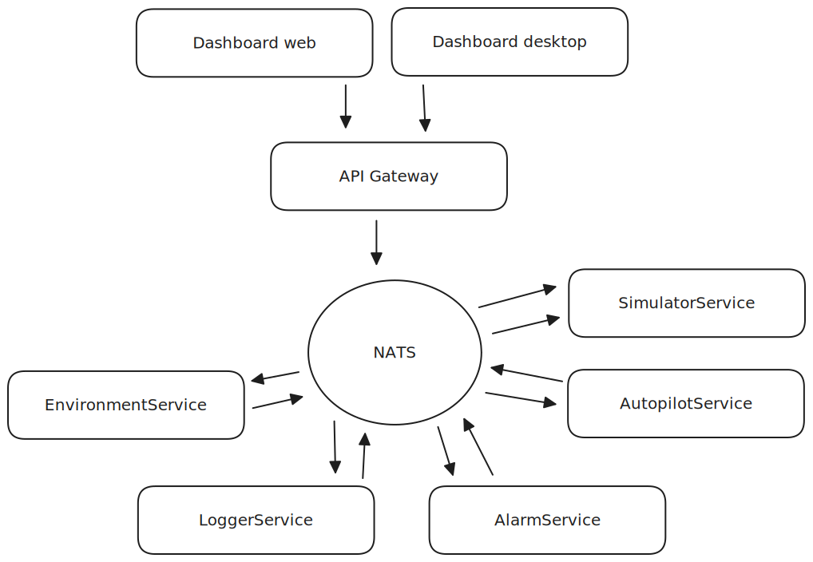

# Systemarkitektur

## 1. Innledning

Dette dokumentet beskriver systemarkitekturen for O-Sim, et personlig utviklingsprosjekt designet for å simulere et autonomt fartøy i et virtuelt miljø. Hovedformålet med O-Sim er å fungere som en praktisk plattform for egen læring og utforskning av moderne programvarearkitektur.

Gjennom dette prosjektet ønsker jeg å tilegne meg erfaring med:

- Modulær systemdesign: Hvordan dele et komplekst problem inn i mindre, håndterbare deler.
- Mikrotjenester: Forstå prinsipper for uavhengige tjenester, deres fordeler, utfordringer og eventuelle ulemper.
- Meldingsbasert kommunikasjon: Erfaring med asynkron kommunikasjon og publish/subscribe-mønstre via NATS.
- Praktisk utvikling: Fra konsept til implementering, inkludert testing og distribusjon med Docker.

O-Sim vil gi mulighet til å kontrollere fartøyet via autopilot, visualisere reisen på kart, og hente inn simulerte sensordata. De kommende seksjonene vil gi en oversikt over systemet oppbygning, beskrive de individuelle komponentene, og forklare hvordan de samhandler for å oppnå funksjonaliteten. Målet er å skape et solid fundament for videre læring og eksperimentering.

## 2. Overordnet Arkitekturprinsipp: Mikrotjenester

O-Sim er bygget rundt prinsippene for en mikrotjenestearkitektur. Dette valget er fundamentalt for prosjektets design og reflekterer et viktig læringsmål: å forstå hvordan komplekse systemer kan brytes ned og organiseres i mindre, uavhengige og håndterbare enheter.

### 2.1. Hva er Mikrotjenester?

En mikrotjenestearkitektur er en tilnærming til programvareutvikling der en enkelt applikasjon er bygget som en samling av små, løst koblede og uavhengige distribuerbare tjenester. Hver tjeneste fokuserer på å løse et spesifikt problem eller utføre én bestemt funksjon. I motsetning til den tradisjonelle monolittiske applikasjonen, hvor all funkasjonalitet er pakket inn i en enkelt, stor og tett koblet kodebase.

I en mikrotjenestearkitektur vil hver tjeneste:

- Ha et spesifikt, veldefinitert ansvar: Den forkuserer på å gjøre én ting, og gjøre den bra. (Single responsibility prinsippet)
- Kunne utvikles uavhengig: Ulike deler av systemet kan bearbeides uten direkte innvirkning på andre tjenester.
- Kunne distribueres uavhengig: En endring i én tjeneste krever ikke at hele applikasjonen må bygges og distribueres på nytt.
- Kommunisere via lette mekanismer: Ofte ved hjelp av veldefinerte API-er (som REST eller gRPC) eller asynkrone meldingskøer (NATS).
- Potensielt bruke ulike teknologier: Selv om O-Sim hovedsakelig bruker .NET, åpner mikrotjenester for å velge det best egnede språket eller rammeverket for en spesifikk tjeneste i fremtidige utgivelser/utvidelser.

### 2.2. Hvorfor Mikrotjenester for O-Sim?

Valget av mikrotjenestearkitektur for O-Sim er drevet av flere faktorer, som fokuset på læring og avveing mot alternative arkitekturer som modulær monolitt.

Mens en modulær monolitt (hvor koden er godt strukturert i separate moduler, men fortsatt kjører som én enkelt applikasjon) kunne vært et enklere utgangspunkt og et godt valg for et lite prosjekt, så falt valget på mikrotjenster av følgende grunner:

- Fokus på læring og utforsking: Hovedmålet med O-Sim er å få praktisk erfaring med å designe, utvikle og drifte et mikrotjenestesystem. Dette inkluderer å lære om inter-tjenestekommunikasjon, tjenestegrenser og uavhengig distribusjon, som er sentrale konsepter mikrotjenester utfordrer deg på. En modulær monolitt ville ikke gitt den samme dybden og innsikten på disse områdene.

- Klarere tjenestegrenser og kontrakter: Mikrotjenester tvinger frem en klar definisjon av API-er og meldingskontrakter mellom tjenester. I en monolitt kan det være lettere å "jukse" med direkte funksjonskall eller delte databaser, noe som kan føre til tette koblinger over tid. For O-Sim sikrer denne disiplinen at hver tjeneste er genuint uavhengig.

- Enklere testbarhet for isolerte komponenter: Med mikrotjenester kan hver tjeneste kjøres og testes fullstendig isolert fra de andre. Dette er en stor fordel for en Test Driven Development (TDD)-tilnærming, da det minimerer behovet for komplekse oppsett for å teste enkelte funksjonsområder.

- Uavhengig distribusjon og skalerbarhet: Selv om det ikke er et behov akkurat nå, gir mikrotjenester muligheten til uavhengig distribusjon av individuelle tjenester. Dette betyr at en endring i f.eks. AutopilotService ikke krever nedetid eller redeploy av SimulatorService. Det åpner også for selektiv skalering av tjenester som krever mer ressurser.

Til tross for økt kompleksitet i infrastruktur og drift som mikrotjenestesystemer ofte medfører(kanskje spesielt for et soloprosjekt), veier de pedagogiske fordelene og den langvarige fleksibiliteten opp.

## 3. Systemkomponenter

O-Sim er en samling av løst koblede komponenter som sammen sørger for simulering- og kontrollfunksjonalitet. Arkitekturen bygger rundt en meldingsbuss som fasiliterer asynkron kommunikasjon mellom mikrotjenestene. Figuren nedenfor illustrerer systemets hovedkomponenter og deres innbyrdes relasjoner.

De viktigste komponentene er:

### 3.1. NATS

- Rolle og formål: NATS fungerer som den sentrale, høyytelses meldingsmekleren for all intern kommunikasjon mellom O-Sims mikrotjenester. Den muliggjør et løst koblet system der tjenester kan publisere informasjon uten å vite hvem som lytter, og abonnere på informasjon uten å vite hvem som publiserer.

- Valg av NATS (vs. Kafka): Valget av NATS fremfor andre meldingsmeklere som Kafka ble gjort med utgangspunkt i O-Sims primære formål som et læringsprosjekt, og behovet for enkelhet og sanntidskommunikasjon.

  - Enkelhet og lettvekt: NATS er betydelig enklere å sette opp, konfigurere og drifte sammenlignet med Kafka. Dette reduserer den infrastrukturelle kompleksiteten og lar fokuset ligge på applikasjonslogikken.

  - Fokus på sanntid: NATS er optimalisert for lav latens og høy ytelse i "fire-and-forget" eller "request-reply" kommunikasjonsmønstre, hvor de nyeste dataene er viktigst og "at-most-once" levering er tilstrekkelig. Dette passer perfekt for en simulator som krever rask utveklsing av sensordata og kommandoer.

  - Ressursvennlighet: Med lavere ressursbrukt (CPU, minne) er NATS et mer velegnet valg for å kjøre alle systemkomponenter lokalt i et Docker Compose-miljø.

- Kommunikasjonsmønstre:

  - Publish/Subscribe: Hovedmønsteret. Tjenester publiserer meldinger til spesifikke emner (topics), og andre tjenester som er interessert, abonnnerer på disse emnene. Dette tillater en-til-mange-kommunikasjon (f.eks. SimulatorService publiserer fartøydata som flere tjenester abonnerer på).

  - Request/Reply: NATS støtter også et mønster for direkte forespørsel-svar, nyttig for mer synkron kommunikasjon der en tjeneste trenger et umiddelbart svar fra en annen (f.eks. for konfigurasjonsspørringer).

- Fordeler i O-Sim (generelt):

  - Løs kobling: Tjenestene er uavhengige av hverandre; de trenger bare å kjenne til NATS og meldingskontraktene. Dette øker robusthet og fleksibilitet.

  - Asynkron kommunikasjon: Forbedrer systemet responsivitet og ytelse, da tjenester ikke blokkerer hverandre mens de venter på svar.

  - Skalerbarhet: NATS er designet for å håndtere store volumer meldinger og kan enkelt skaleres for å møte fremtidige behov.

  - Enkelhet: Enkel å sette opp og bruke i et Docker-miljø, noe som er fordelaktig for et læringsprosjekt.

- NATS emner (eksempler på nøkkelemner):

  - sim.sensor.nav: Fartøyets navigasjonsdata (posisjon, fart, kurs). Publiseres av SimulatorService.

  - sim.sensors.env: Miljødata (vind, strøm). Publiseres av EnvironmentService.

  - sim.commands.\*: Kommandoer til simulatoren eller autopiloten (f.eks. sim.commands.setcourse, sim.commands.rudder ). Publiseres av AutopilotService eller API Gateway.

  - log.entries: Generiske loggmeldinger fra alle tjenester. Publiseres av relevante tjenester.

  - alarm.triggers: Utløste alarmer. Publiseres av AlarmService.

  - env.commands.setmode: Kommando for å bytte miljømodus i EnvironmentService.

- Detaljerte kontrakter: De eksakte JSON-strukturene for meldingene definieres i docs/api-contracts.md og implementeres som C# DTO-er i shared/Osim.Shared.Messages.

### 3.2. API Gateway (Traefik)

- Rolle og formål: API Gateway fungerer som det enhetlige inngangspunktet for alle eksterne klienter som ønsker å interagere med O-Sim systemet. Hovedformålet med å innføre en API Gateway er å abstrahere og frikoble frontend-applikasjonene fra de underliggende mikrotjenestene. Dette muliggjør utvikling av flere forskjellige brukergrensesnigg (f.eks. både en desktop-applikasjon og en web-applikasjon) uten at de må kjenne til eller koble seg direkte til de individuelle mikrotjenestene. Ved å benytte Traefik som API Gateway oppnås dette sømløst i et Docker-miljø.

- Valg av Traefik: Traefik ble valgt for O-Sim gunnet dets styrker innen dynamisk konfigurasjon og enkel integrasjon i Docker-miljøer:

  - Dynamisk Tjenesteoppdagelse: Traefik kan automatisk oppdage nye tjenester og konfigurere rutene basert på Docker-labels. Dette eliminerer behovet for manuell rekonfigurasjon ved endringer i tjenestelandskapet.

  - Enkelhet i Docker Compose: Konfigurasjon er intuitiv og defineres direkte i docker-compose.yml ved hjelp av enkle labels.

  - Ressursvennlig: En lettvektsløsning med god ytelse, ideell for et lokalt utviklingsmiljø.

  - Innebygd Dashbord: Tilbyr sanntidsinnsikt i trafikkflyt og ruter, nyttig for feilsøking.

- Nøkkelkonfigurasjon i O-Sim:

  - Ruteføring (Routing): Videresender innkommende HTTP-forespørsler og WebSocket-tilkoblinger fra Frontend GUI til de korresponderende interne mikrotjenestene.

  - Lastbalansering: Kan fordelere trafikk mellom flere instanser av en mikrotjeneste, om nødvendig.

## 3.3.

O-Sim består av flere dedikerte mikrotjenester, hver med et klart definert ansvar og som kommuniserer asynkront via NATS. Alle mikrotjenestene er utviklet i C# (.NET 9) og kjøres som separate Docker-containere.

### 3.3.1. SimulatorService

- Ansvar: Fungerer som kjernen i simulatoren ved å modellere fartøyets dynamikk (posisjon, fart, kurs, heading, etc.). Den simulerer hvordan fartøyet beveger seg og reagerer på ytre krefter og kommandoer.

- Innkommende kommunikasjon (via NATS):

  - Abbonerer på sim.commands.\* (f.eks. sim.commands.rudder, sim.commands.thrust) for å motta kontrollsignaler fra AutopilotService eller manuelle kommandoer via API Gateway.

- Utgående kommunikasjon (via NATS):

  - Publiserer kontinuerlig fartøyets aktuelle navigasjonsdata til sim.sensors.nav. Disse dataene er avgjørende for AutopilotService, LoggerService og Frontend GUI.

- Nøkkelfunksjonalitet:

  - Matematisk modellering av fartøyets bevegelse.

  - Håndtering av treghet, friksjon og andre fysiske aspekter.

  - Behandling av innkommende kommandoer.

  - Generering av simulerte navigasjonsdata (posisjon, hastighet, kurs).

### 3.3.2. EnvironmentService

- Ansvar: Genererer og publiserer simulerte miljødata som påvirker fartøyet, primært vind, strøm og bølger. Denne tjenesten fungerer som erstatning for virkelige miljøsensorer i et kontrollert simuleringsmiljø.

- Innkommende kommunikasjon (via NATS):

  - Abbonerer på env.commands.setmode for å dynamisk bytte mellom ulike simuleringsmoduser (f.eks. "rolige forhold", "vindfull dag", "full storm", "store bølger").

- Utgående kommunikasjon (via NATS):

  - Publiserer kontinuerlig miljødata til sim.sensors.env.

- Nøkkelfunksjonalitet:

  - Generering av simulert vindhastighet og vindretning.

  - Generering av simulert strømhastighet og strømretning.

  - Generering av simulerte bølgeparametre (f.eks. bølgehøyde, -retning, og -periode).

  - Administrering av forskjellige simuleringsmoduser for miljøet.

- Utvidelsespotensial: I fremtidige utvidelser kan denne tjenesten få flere miljøfaktorer som har betydning for fartøysdynamikken og simuleringen:

  - Vanndybde og sjøbunn: Implementering av grunnvannseffekter som påvirker manøvrering og motstand i grunt farvann.

  - Siktforhold: Simulering av tåke, regn og/eller nattforhold som påvirker visuell navigasjon.

  - Eksterne data: Mulighet for å hente inn sanntidsdata fra eksterne APIer (f.eks. for vær og strøm) som et alternativ til full simulering.

### 3.3.3. AutopilotService

- Ansvar: Implementerer kontrollalgoritmer for å autonomt styre fartøyets kurs og/eller fart basert på settpunkter og innhentede sensordata. Den fungerer som "hjernen" som tar beslutninger for fartøyet.

- Innkommende kommunikasjon (via NATS):

  - Abonerer på sim.sensors.nav (fra SimulatorService) for å få fartøyets aktuelle posisjon, kurs og fart.

  - Abonnerer på sim.sensors.env (fra EnvironmentService) for å ta hensyn til ytre påvirkninger.

  - Mottar settpunkter for ønsket kurs/fart via sim.commands.setcourse, sim.commands.setspeed (publisert av API Gateway ved brukerinteraksjon).

- Utgående kommunikasjon (via NATS):

  - Publiserer kontrollkommandoer (f.eks. rorutslag, thrust) til sim.commands.rudder, sim.commands.thrust som SimulatorService da reagerer på.

- Nøkkelfunksjonalitet:

  - Implementering av PID-kontroller (eller lignende) for kursholding og fartsholding.

  - Behandling av avvik mellom ønsket og faktisk tilstand.

  - Generering av aktuator-kommandoer for simulator.

### 3.3.4. AlarmService

- Ansvar: Overvåker ulike datastrømmer i systemet for å detektere og varsle om uregelmessigheter, avvik eller kritiske hendelser.

- Innkommende kommunikasjon (via NATS)

  - Abonnerer på relevante emner som sim.sensors.nav, sim.sensors.env, log.entries, eller andre spesifikke data som krever overvåking for å identifisere avvik (f.eks. fartøy utenfor definert område, overskridelse av grenseverdier for fart/kurs).

- Utgående kommunikasjon (via NATS):

  - Publiserer alarmer og varsler til alarm.triggers for logging og presentasjon i Frontend GUI.

- Nøkkelfunksjonalitet:

  - Definering av regler for hva som utgjør en alarm.

  - Kontinuerlig analyse av innkommende data mot disse reglene.

  - Generering av alarmmeldinger med status og detaljer.

### 3.3.5. LoggerService

- Ansvar: Er systemet sentrale punkt for datapersistens. Den lagrer alle relevante simuleringsdata, kommandoer og hendelser for senere analyse, avspilling eller feilsøking.

- Innkommende kommunikasjon (via NATS)

  - Abonnerer på et bredt spekter av NATS-emner, inkludert, men ikke begrenset til, sim.sensors.nav, sim.sensors.env, sim.commands.\*, alarm.triggers, og log.entries. Målet er å fange opp all systemaktivitet.

- Utgående kommunikasjon:

  - Persisterer data til et valgt lagringdsmedium (f.eks. CSV-filer for enkelhet, eller en relasjonsdatabase som SQLite/PostgreSQL for mer strukturert lagring).

- Nøkkelfunksjonalitet:

  - Motta og deserialisere NATS-meldinger.

  - Strukturert lagring av data.

  - (Fremtidig): Funksjonalitet for å hente ut historisk data for visualisering eller analyse.
